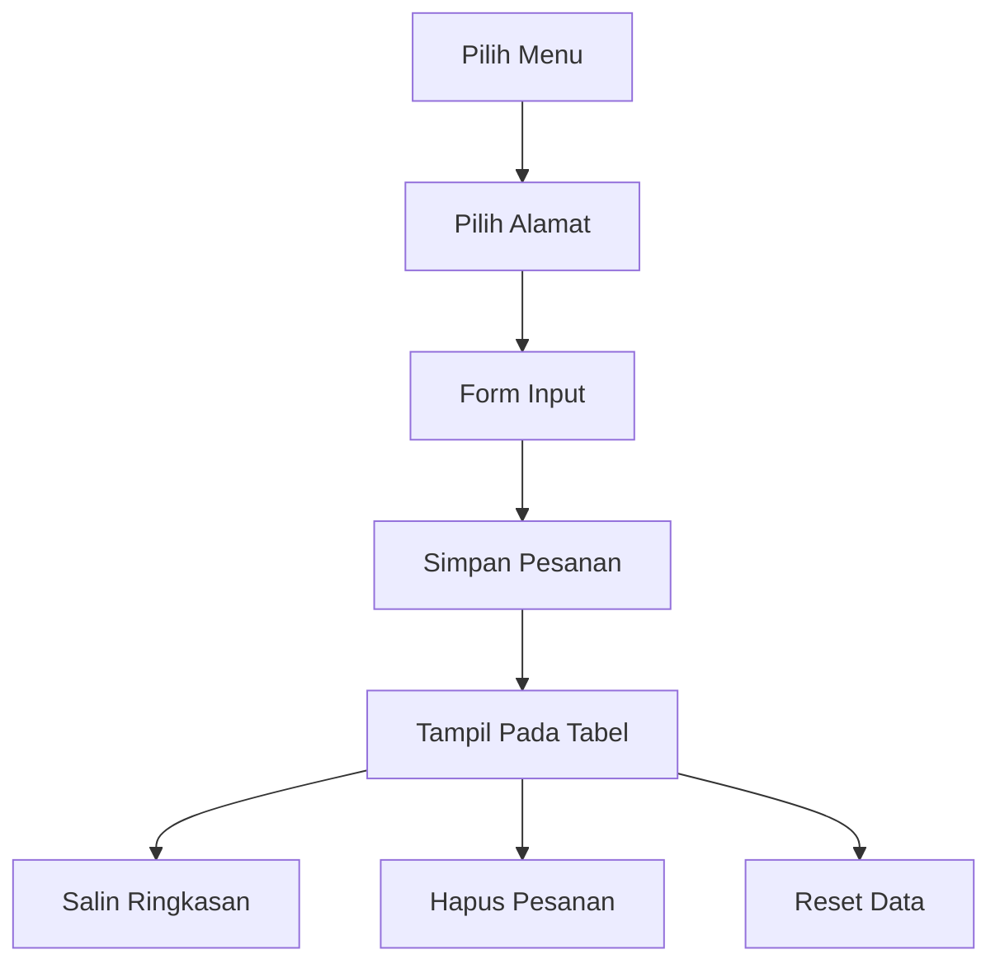

# 🍱 JadiJajan

<div align="center">

### Sistem Pencatatan Pesanan Sederhana Berbasis Browser

Aplikasi pencatatan pesanan yang ringan, cepat, dan dapat berjalan tanpa server menggunakan Local Storage Browser.


</div>

---

## ✨ Fitur Utama

### 🍔 Manajemen Menu

- Membuat hingga 4 menu utama.
- Nama menu dapat diubah kapan saja.
- Penyimpanan otomatis ke browser.
- Tidak memerlukan database.

### 📍 Manajemen Alamat / Jenjang

Pilihan bawaan:

- SD
- SMP
- SMA

Tambahan:

- Alamat khusus (custom address)
- Dapat diedit kapan saja
- Tidak terbatas pada jenjang sekolah

---

### 📝 Pencatatan Pesanan

Setiap pesanan berisi:

| Data | Keterangan |
|--------|--------|
| Nama Pemesan | Nama pelanggan |
| Menu | Menu yang dipilih |
| Alamat | Tujuan pengiriman |
| Jumlah | Banyak pesanan |
| Timestamp | Waktu input |

---

### 📊 Daftar Pesanan

Fitur:

- Menampilkan seluruh pesanan.
- Pengurutan berdasarkan alamat.
- Penghapusan pesanan individual.
- Counter jumlah pesanan realtime.

---

### 📋 Salin Ringkasan

Menghasilkan format yang siap dikirim ke:

- WhatsApp
- Telegram
- Grup Sekolah
- Admin Produksi

Contoh:

```text
📋 RINGKASAN DAFTAR PESANAN

📍 SD
1. Andi -> Nasi Goreng (2 porsi)
2. Sinta -> Mie Ayam (1 porsi)

📍 SMP
1. Budi -> Nasi Goreng (3 porsi)
```

---

### ♻️ Reset Data

Membersihkan:

- Seluruh daftar pesanan
- Pilihan menu aktif
- Pilihan alamat aktif

Tetap mempertahankan:

- Nama menu

---

## 🎨 Tampilan Modern

Versi terbaru menggunakan konsep:

### Glassmorphism

- Card transparan
- Blur background
- Floating UI

### Soft Pastel Gradient

Kombinasi warna:

- Pink pastel
- Baby blue
- Mint green
- Soft cream

### Floating Background

- Animated blur orb
- Efek kedalaman modern
- Ringan tanpa library tambahan

### Responsive Design

Optimal untuk:

- Desktop
- Laptop
- Tablet
- Smartphone

---

## 🖼️ Preview Struktur Aplikasi

```text
┌──────────────────────────────┐
│ 🍱 JadiJajan                 │
│ Sistem Pencatatan Pesanan    │
│                12 Pesanan    │
└──────────────────────────────┘

┌──────────────────────────────┐
│ 🍳 Pilihan Menu             │
│ [Nasi Goreng] [Mie Ayam]     │
└──────────────────────────────┘

┌──────────────────────────────┐
│ 📍 Alamat / Jenjang         │
│ [SD] [SMP] [SMA]            │
└──────────────────────────────┘

┌──────────────────────────────┐
│ 📋 Daftar Pesanan           │
│                              │
│ No Nama Menu Alamat Jumlah  │
│                              │
└──────────────────────────────┘
```

---

# ⚙️ Teknologi

## Frontend

- HTML5
- CSS3
- Bootstrap 5.3
- Bootstrap Icons

## Logic

- Vanilla JavaScript

## Storage

- Browser LocalStorage

---

# 📂 Struktur Project

```text
jadijajan/
│
├── index.html
├── README.md
│
└── assets/
```

---

# 🚀 Cara Menjalankan

## Metode 1

Buka langsung:

```text
index.html
```

di browser.

Tidak membutuhkan:

- PHP
- MySQL
- Node.js
- Build Process

---

## Metode 2

Menggunakan Live Server VS Code

```bash
Right Click
→ Open with Live Server
```

---

# 💾 Penyimpanan Data

Aplikasi menggunakan:

```javascript
localStorage
```

Key yang digunakan:

```javascript
app_menus
app_orders
```

Data tersimpan di browser pengguna.

---

# 🔄 Alur Penggunaan



---

# 🧠 Filosofi Desain

Aplikasi dibuat dengan prinsip:

### Cepat

Tidak perlu login.

### Sederhana

Satu halaman untuk seluruh proses.

### Offline First

Tetap berfungsi tanpa internet.

### Mudah Digunakan

Dapat digunakan oleh:

- Guru
- Admin Kantin
- Penjual Makanan
- UMKM
- Orang Tua Murid

---

# 📈 Roadmap Pengembangan

## Versi Saat Ini

- [x] Multi menu
- [x] Multi alamat
- [x] Local Storage
- [x] Sort alamat
- [x] Copy WhatsApp
- [x] Glassmorphism UI

---

## Versi Selanjutnya

- [ ] Export Excel
- [ ] Export PDF
- [ ] Statistik penjualan
- [ ] Rekap per menu
- [ ] Rekap per alamat
- [ ] Mode Dark Theme
- [ ] Backup & Restore Data
- [ ] Sinkronisasi Cloud
- [ ] Progressive Web App (PWA)

---

# 🔐 Privasi

Semua data:

- Disimpan lokal pada browser.
- Tidak dikirim ke server.
- Tidak membutuhkan akun.
- Tidak membutuhkan login.

---

# 📄 Lisensi

MIT License

---

<div align="center">

### 🍱 JadiJajan

Sederhana • Cepat • Modern • Tanpa Server

</div>
